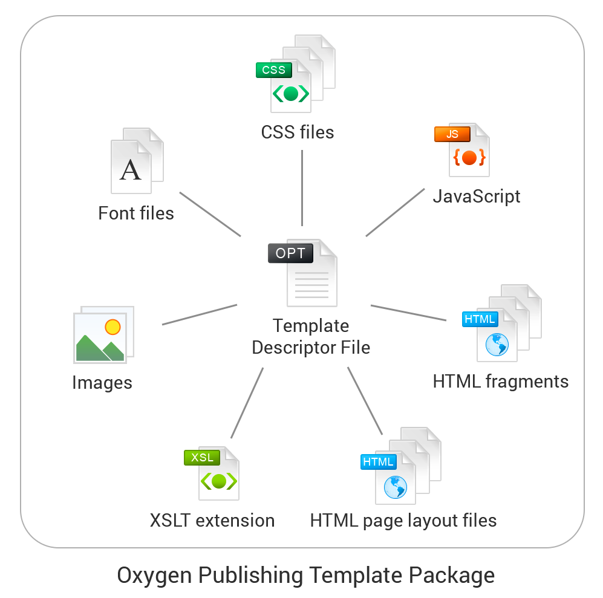

# Oxygen Publishing Template Samples
Project containing various examples of Oxygen Publishing Templates.

This is a demo project that introduces the concept of the Oxygen Webhelp [Publishing Template](https://www.oxygenxml.com/doc/ug-editor/topics/whr-publishing-template.html) that defines all aspects of the layout and
style of WebHelp Responsive output. 

The possible benefits for using the publishing template package include:
- You can use any of the existing built-in templates as a starting point for future customizations
- The customized template packages are easy to share with others
- Custom template packages remain intact even when you upgrade Oxygen to a new version
- A publishing template can be easily integrated with a continuous integration publishing system

Each WebHelp Responsive publishing template is a package that contains a [descriptor](https://www.oxygenxml.com/doc/versions/20.0/ug-editor/topics/whr_publishing_template_contents.html#ariaid-title2) file and
various resources. The descriptor file controls the template package by defining the references to the
other resources in the package.

# Publishing Templates examples:
* [Space Exploration](https://github.com/balasaalin/oxygen-publishing-template-samples/wiki/Space-Exploration) - This is the template used for the Oxygen WebHelp Publishing Template [presentation video](https://www.youtube.com/watch?v=Q0rZy1oyyUk).
* [Generation Date & Time](https://github.com/balasaalin/oxygen-publishing-template-samples/wiki/Generation-Date-&-Time) - Template containing XSLT extensions that add the generation date & time to the WebHelp Responsive footer.
* [Bookmap Copyright Info](https://github.com/balasaalin/oxygen-publishing-template-samples/wiki/Bookmap-Copyright-Info) - Template containing XSLT extensions that can transfer meta information specified in the DITA map to the WebHelp Responsive footer.

# Project layout
This project has the following layout:
- **dita** - Contains DITA map samples that can be published with the available templates.
- **templates** - The [Publishing Templates Gallery](https://www.oxygenxml.com/doc/ug-editor/topics/whr-pt-feature-gallery.html) stored at project level
- **resources** - Project miscellaneous resources
- **oxygen-publishing-template-samples.xpr** - Oxygen project file
