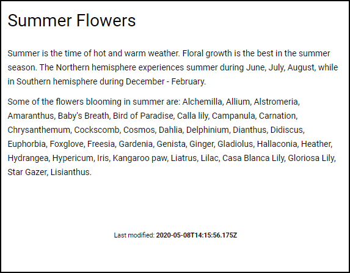
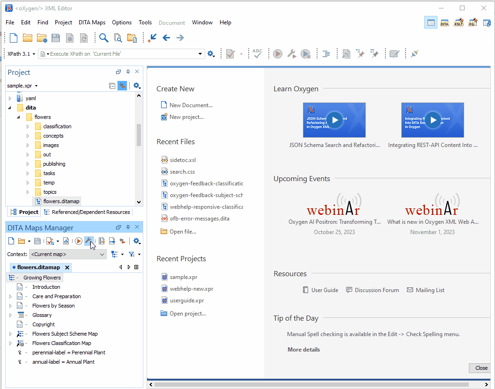

# Last modified date & time after the topic content (tested with Oxygen 26.0)

## !!! NOTE: This template is not compatible with versions 25.0 and 25.1 of Oxygen

This is a sample publishing template that displays the last modified date and time of the source topic.



It uses an 
[XSLT Extension](https://www.oxygenxml.com/doc/versions/22.1/ug-webhelp-responsive/topics/whr-responsive-override-xslt-dita-xslt-import.html) File to customize the structure of the `whc:webhelp_topic_content` component.

The XSLT extension uses the
[`file:last-modified()`](https://www.saxonica.com/html/documentation/functions/expath-file/last-modified.html) function to extract that information directly from the DITA source file itself. 

**NOTE:** According the Saxonica documentation, the `file:last-modified()` function is only available in the Saxon-PE and Saxon-EE distributions. DITA-OT comes bundled with Saxon HE which means that you cannot use the above XSLT extension point out-of-the-box in WebHelp Responsive. You need to add Saxon EE to the DITA-OT's classpath when using this Publishing Template.

The XSLT extension:
```xml
<?xml version="1.0" encoding="UTF-8"?>
<xsl:stylesheet xmlns:xsl="http://www.w3.org/1999/XSL/Transform"
    xmlns:xs="http://www.w3.org/2001/XMLSchema"
    xmlns:whc="http://www.oxygenxml.com/webhelp/components"
    xmlns:file="http://expath.org/ns/file"
    exclude-result-prefixes="xs file whc"
    version="3.0">
    
    <xsl:template match="whc:webhelp_topic_content" mode="copy_template">
        <xsl:param name="i18n_context" select="/*" tunnel="yes" as="element()"/>
        <xsl:next-match/>
        <xsl:variable name="docUri" select="$i18n_context/*/@xtrf"/>
        <div class="last-modified">
            <xsl:variable name="lastModified" select="file:last-modified($docUri[1])"/>
            <time datetime="{$lastModified}"><xsl:value-of select="$lastModified"/></time>
        </div>
    </xsl:template>
</xsl:stylesheet>
```

The Publishing Template also uses a custom CSS file (`last-modified-in-content.css`) to style the newly inserted content:
```css
.last-modified {
    font-size:0.75em;
    font-weight:bold;
    text-align:center;
}
.last-modified::before {
  content: "Last modified: ";
  font-weight: normal;
}
```

### How to use the Saxon EE library bundled in Oxygen XML Editor to generate WebHelp Responsive Output
If you are generating WebHelp Responsive output using a **transformation scenario from Oxygen XML Editor or Author** you can configure the transformation to use the Saxon EE library that is bundled in Oxygen:
1. In the DITA Map Manager View click the Configure Transformation Scenario(s) icon on the view's toolbar.
1. Edit your copy of DITA Map WebHelp Responsive transformation scenario.
1. Go to Advanced tab
1. Uncheck *Prefer using the "dita" command*
1. Click on Libraries button
1. Uncheck Allow Oxygen to add high priority libraries to the classpath
1. Add the `${oxygenHome}/lib/*saxon*12*.jar` entry at the top of the list. (Click on Up arrow button on the right until the selected entry reaches the top of the list)
1. Save the transformation scenario




