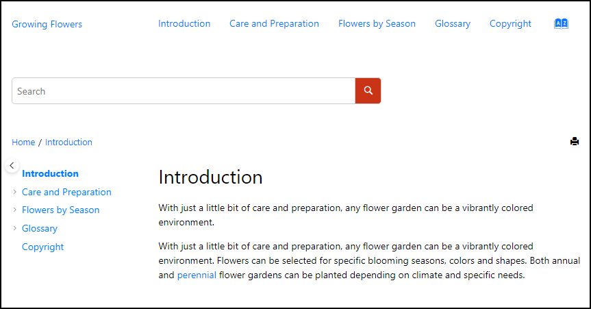

# Align Search Input with Breadcrumb

This is a sample publishing template that customizes the layout of the search input and aligns it with the breadcrumb component in each topic page..



The template uses an [XSLT Extension](https://www.oxygenxml.com/doc/versions/25.0/ug-webhelp-responsive/topics/whr-responsive-override-xslt-dita-xslt-import.html) file to modify the nodes hierarch of the Search Component. The Search Component needs to be wrapped with the same node types as the Breadcrumb component in order to facilitate the alignment :
```
<xsl:stylesheet xmlns:xsl="http://www.w3.org/1999/XSL/Transform"
    xmlns:xs="http://www.w3.org/2001/XMLSchema"
    xmlns:whc="http://www.oxygenxml.com/webhelp/components"
    exclude-result-prefixes="xs whc"
    version="2.0">
    
    <xsl:template match="whc:webhelp_search_input" mode="copy_template">
        <!-- Wrap the Search Component in a Bootstrap container -->
        <div class="container-fluid">
            <div class="row">
                <!-- Apply default processing. -->
                <xsl:next-match/>
            </div>
        </div>
    </xsl:template>
</xsl:stylesheet>
```


The Publishing Template also uses a custom CSS file (`align-search-and-breadcrumb.css`) to align the Search Component with the Breadcrumb Component.
```
.wh_topic_page .wh_search_input {
  width: 100%;
  margin: 0 15px;
}

.wh_topic_page #searchForm>div {
  margin: 0;
}

.wh_topic_page .wh_header {
  padding-left: 0;
  padding-right: 0;  
}
```

## How to use the Cutsomization

To use this customization in your custom Publishing Template you must perform the following steps:

1. Copy the *xslt/search.xsl* file in your template's base directory
1. Reference the XSL file in the *&lt;xslt>* section of your template's descriptor file (*opt*):
    ```
    <xslt>
        <extension file="xslt/search.xsl" id="com.oxygenxml.webhelp.xsl.dita2webhelp"/>
    </xslt>
    ```
1. Copy the *align-search-and-breadcrumb.css* file and reference it in the *&lt;css>* section of your *opt* file. Alternatively you can copy the CSS rules from *align-search-and-breadcrumb.css* into your template's CSS file.

**Note:** If you haven't created a Publishing Template yet, you can create one by following the procedure described in [this topic](https://www.oxygenxml.com/doc/versions/25.0/ug-webhelp-responsive/topics/whr-create-publishing-template-x.html).


