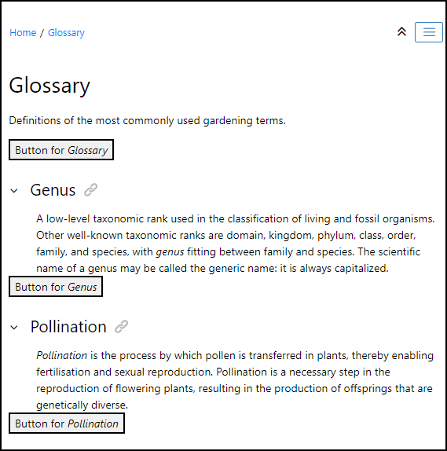

# Button inserted after each topic body

This is a sample publishing template that inserts a custom button after the body of each topic.
If the HTML page contains several nested topics a button is inserted in each topic.



It uses an 
[XSLT Extension](https://www.oxygenxml.com/doc/versions/24.1/ug-webhelp-responsive/topics/whr-responsive-override-xslt-dita-xslt-import.html) File to insert the button at the end of each topic.

The XSLT extension:
```xml
<xsl:stylesheet xmlns:xsl="http://www.w3.org/1999/XSL/Transform"
    xmlns:xs="http://www.w3.org/2001/XMLSchema"
    xmlns:math="http://www.w3.org/2005/xpath-functions/math" exclude-result-prefixes="xs math"
    version="3.0">

    <xsl:template match="*[contains(@class, ' topic/topic ')]" mode="child.topic">
        <xsl:variable name="topic-content">
            <xsl:next-match/>
        </xsl:variable>
        <xsl:apply-templates mode="insert-button" select="$topic-content/*"/>
    </xsl:template>

    <xsl:template match="*" mode="addContentToHtmlBodyElement">
        <xsl:variable name="topic-content">
            <xsl:next-match/>
        </xsl:variable>
        <xsl:apply-templates mode="insert-button" select="$topic-content/*"/>
    </xsl:template>
    
    <xsl:template match="node() | @*" mode="insert-button">
        <xsl:copy>
            <xsl:apply-templates select="node() | @*" mode="insert-button"/>
        </xsl:copy>
    </xsl:template>
    
    <xsl:template match="article[not(button)]/*[contains(@class, 'topic/body') or contains(@class, 'topic/abstract') or contains(@class, 'topic/shortdesc')]" mode="insert-button">
        <xsl:variable name="topicTitle" select="parent::article/*[contains(@class, 'topic/title')]"/>
        <xsl:variable name="topicId" select="parent::article/@id"/>
        <xsl:copy>
            <xsl:apply-templates select="node() | @*" mode="insert-button"/>
        </xsl:copy>
        <button data-topic-id="{$topicId}">Button for <i><xsl:value-of select="$topicTitle"/></i></button>
    </xsl:template>   
</xsl:stylesheet>
```


