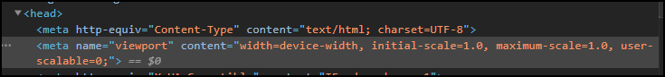

# Change Viewport Meta

This is a sample publishing template that uses an 
[XSLT Extension](https://www.oxygenxml.com/doc/versions/22.0/ug-webhelp-responsive/topics/whr-responsive-override-xslt-dita-xslt-import.html) File to customize the value of the `viewport <meta>`.



The XSLT extension:
```
<xsl:stylesheet xmlns:xsl="http://www.w3.org/1999/XSL/Transform"
    xmlns:xs="http://www.w3.org/2001/XMLSchema"
    exclude-result-prefixes="xs"
    version="3.0">
    
    <xsl:template match="*:meta[@name='viewport']/@content" mode="copy_template">
        <xsl:attribute name="{name()}">width=device-width, initial-scale=1.0, maximum-scale=1.0, user-scalable=0;</xsl:attribute>
    </xsl:template>
</xsl:stylesheet>
```


