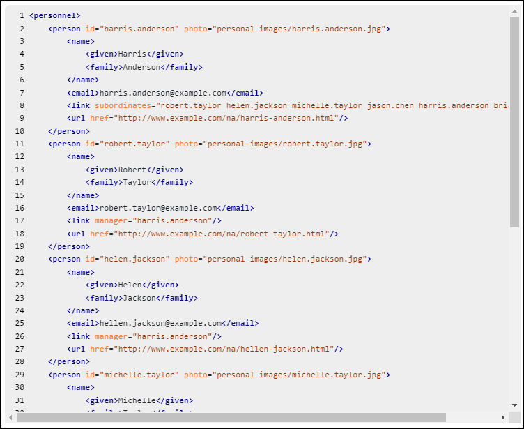

# Line Numbering in Code Blocks

This is a sample publishing template that improves the display of code blocks by adding line numbering.



The template uses an [XSLT Extension](https://www.oxygenxml.com/doc/versions/25.0/ug-webhelp-responsive/topics/whr-responsive-override-xslt-dita-xslt-import.html) file to modify the HTML5 structure generated for the code block. Each new line of code is preceded by a `<span>` node that is used to display the current line number.

```xml
<xsl:stylesheet xmlns:xsl="http://www.w3.org/1999/XSL/Transform"
    xmlns:xs="http://www.w3.org/2001/XMLSchema"
    exclude-result-prefixes="xs"
    version="2.0">
    
    <xsl:template match="*[contains(@class, ' pr-d/codeblock ')]">
        <xsl:variable name="nm">
            <xsl:next-match/>
        </xsl:variable>
        <xsl:apply-templates select="$nm" mode="line-numbering"/>
    </xsl:template>
    
    <xsl:template match="node() | @*" mode="line-numbering">
        <xsl:copy>
            <xsl:apply-templates select="node() | @*" mode="#current"/>
        </xsl:copy>
    </xsl:template>
    
    <xsl:template match="*[contains(@class, ' pr-d/codeblock ')]" mode="line-numbering">
        <xsl:element name="{name()}">
            <xsl:copy-of select="@*"/>
            <span class="+ topic/pre pr-d/codeblock-new-line pre codeblock-new-line"/>
            <xsl:apply-templates mode="#current"/>
        </xsl:element>
    </xsl:template>
    
    <xsl:template match="*[contains(@class, ' pr-d/codeblock ')]//text()" mode="line-numbering">
        <xsl:analyze-string regex="\n" select=".">
            <xsl:matching-substring>
                <xsl:value-of select="."/>
                <span class="+ topic/pre pr-d/codeblock-new-line pre codeblock-new-line"/>
            </xsl:matching-substring>
            <xsl:non-matching-substring>
                <xsl:value-of select="."/>
            </xsl:non-matching-substring>
        </xsl:analyze-string>
    </xsl:template>
    
</xsl:stylesheet>
```


The Publishing Template also uses a custom CSS file (`codeblock-line-numbering.css`) to display and style the line numbers.
```css
.codeblock {
  counter-reset: codeblock-line-number;
}

.codeblock-new-line {
  display: inline-block;
  min-width: 2em;
  border-right: 1px solid #ccc;
  text-align: right;
  padding-right: 2px;
  margin-right: 4px;
}

.codeblock-new-line::before {
  color: initial;
  counter-increment: codeblock-line-number;
  content: counter(codeblock-line-number);
}
```

## How to use the Customization

To use this customization in your Publishing Template you must perform the following steps:

1. Copy the *xslt/codeblock-line-numbering.xsl* file in your template's base directory
1. Reference the XSL file in the *&lt;xslt>* section of your template's descriptor file (*opt*):
    ```xml
    <xslt>
        <extension file="xslt/codeblock-line-numbering.xsl" id="com.oxygenxml.webhelp.xsl.dita2webhelp"/>
    </xslt>
    ```
1. Copy the *codeblock-line-numbering.css* file and reference it in the *&lt;css>* section of your *opt* file. Alternatively you can copy the CSS rules from *codeblock-line-numbering.css* into your template's CSS file.

**Note:** If you haven't created a Publishing Template yet, you can create one by following the procedure described in [this topic](https://www.oxygenxml.com/doc/versions/25.0/ug-webhelp-responsive/topics/whr-create-publishing-template-x.html).


