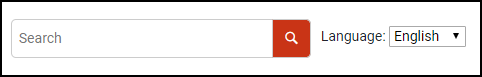

# Custom Content After Search Template

This is a sample publishing template that contributes custom HTML content after the search input.



It uses an 
[XSLT Extension](https://www.oxygenxml.com/doc/versions/25.1/ug-webhelp-responsive/topics/whr-responsive-override-xslt-dita-xslt-import.html) file to customize the structure of the `search component`.

The XSLT extension loads the
[HTML Fragment](https://www.oxygenxml.com/doc/versions/25.1/ug-webhelp-responsive/topics/wh-add-custom-html.html#wh-add-custom-html__the_xml_file) that needs to be inserted in the output page from an XML file (`after-search-fragment.xml`)  using a custom transformation parameter (`custom.webhelp.after.search.fragment`) defined in the 
[Publishing Template's Descriptor File](https://www.oxygenxml.com/doc/versions/25.1/ug-webhelp-responsive/topics/whr_publishing_template_contents.html#ariaid-title2) (`\*.opt`).

The XSLT extension (`xsl/custom-content-after-search.xsl`):
```xml
<xsl:stylesheet xmlns:xsl="http://www.w3.org/1999/XSL/Transform"
    xmlns:xs="http://www.w3.org/2001/XMLSchema"
    xmlns:whc="http://www.oxygenxml.com/webhelp/components"
    xmlns:oxyf="http://www.oxygenxml.com/functions"
    exclude-result-prefixes="xs"
    version="2.0">
    <xsl:template match="whc:webhelp_search_input" mode="copy_template">
        <xsl:param name="template_base_uri" tunnel="yes"/>
        <xsl:param name="i18n_context" tunnel="yes" as="element()*"/>
        
        <div class="custom-search-component">
            <!-- Apply default processing -->
            <xsl:next-match/>
            <!-- Output your content here -->
            <div class="after-search">
                <xsl:variable name="afterSearchContentFragment" select="oxyf:getParameter('custom.webhelp.after.search.fragment')"/> 
                
                <xsl:call-template name="extractFileContent">
                    <xsl:with-param name="href" select="$afterSearchContentFragment"/>
                    <xsl:with-param name="template_base_uri" select="$template_base_uri"/>
                </xsl:call-template>
            </div>
        </div>
    </xsl:template>
</xsl:stylesheet>
```

The HTML Fragment (`fragments\after-search-fragment.xml`):
```xml
<div class="after-search">
    <div class="language-container">
        <label class="lang-label" for="languages">Language:</label>
        <select id="languages" class="lang-selector">
            <option value="en" selected="true">English</option>
            <option value="fr">Français</option>
            <option value="es">Español</option>
            <option value="de">Deutsch</option>
        </select>  
    </div>
</div>
```
The Publishing Template also uses a custom CSS file (`search.css`) to layout the inserted fragment next to the search component:
```css
.custom-search-component {
  display: flex;
  align-items: center;
  justify-content: flex-end;
  padding: 20px;
}

.wh_search_input {
  padding: 0 !important;
  background: none !important;
  min-width: 300px;
  margin: 0 !important;
}

#searchForm > div {
  margin: 0;
  width: initial;
}

.after-search {
  padding-left: 10px;
}
```

## How to use the Customization

To use this customization in your Publishing Template you must perform the following steps:

1. Copy the *xsl/custom-content-after-search.xsl* file in the *xsl* sub-folder of your template's base directory
1. Reference the file in the *&lt;xslt>* section of your template's descriptor file (*opt*):
```xml
<xslt>
    <extension file="xsl/custom-content-after-search.xsl" id="com.oxygenxml.webhelp.xsl.createMainPage"/>
    <extension file="xsl/custom-content-after-search.xsl" id="com.oxygenxml.webhelp.xsl.createSearchPage"/>
    <extension file="xsl/custom-content-after-search.xsl" id="com.oxygenxml.webhelp.xsl.dita2webhelp"/>
</xslt>
```
1. Copy the *fragments/after-search-fragment.xml* file in the *fragments* sub-folder of your template's base directory
1. Reference the file in the *&lt;html-fragments>* section of your template's descriptor file (*opt*):
```xml
<html-fragments>
    <fragment file="fragments/after-search-fragment.xml" placeholder="webhelp.fragment.after.search.input"/>
</html-fragments>
```
1. Copy the *search.css* file and reference it in the *&lt;css>* section of your *opt* file. Alternatively you can copy the CSS rules from *search.css* into your template's CSS file.

**Note:** If you haven't created a Publishing Template yet, you can create one by following the procedure described in [this topic](https://www.oxygenxml.com/doc/versions/25.1/ug-webhelp-responsive/topics/whr-create-publishing-template-x.html).


