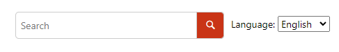

# Custom Content After Search Template

This is a sample publishing template that inserts a custom [HTML Fragment](https://www.oxygenxml.com/doc/versions/25.1/ug-webhelp-responsive/topics/wh-add-custom-html.html#wh-add-custom-html__the_xml_file) after the search input of each output page.



The HTML Fragment (`fragments/after-search-fragment.xml`):
```xml
<div class="after-search">
    <div class="language-container">
        <label class="lang-label" for="languages">Language:</label>
        <select id="languages" class="lang-selector">
            <option value="en" selected="true">English</option>
            <option value="fr">Français</option>
            <option value="es">Español</option>
            <option value="de">Deutsch</option>
        </select>  
    </div>
</div>
```
The Publishing Template also uses a custom CSS file (`search.css`) to style the inserted fragment next to the search component:
```css
.wh_search_input {
  display: flex;
  align-items: center;
  justify-content: flex-end;
  padding: 20px;
}

#searchForm > div {
  width: initial;
  min-width: 300px;
}

.after-search {
  padding-left: 10px;
}
```

## How to use the Customization

To use this customization in your Publishing Template you must perform the following steps:

1. Copy the *fragments/after-search-fragment.xml* file in the *fragments* sub-folder of your template's base directory
1. Reference the file in the *&lt;html-fragments>* section of your template's descriptor file (*opt*):
```xml
<html-fragments>
    <fragment file="fragments/after-search-fragment.xml" placeholder="webhelp.fragment.after.search.input"/>
</html-fragments>
```
1. Copy the *search.css* file and reference it in the *&lt;css>* section of your *opt* file. Alternatively you can copy the CSS rules from *search.css* into your template's CSS file.

**Note:** If you haven't created a Publishing Template yet, you can create one by following the procedure described in [this topic](https://www.oxygenxml.com/doc/versions/25.1/ug-webhelp-responsive/topics/whr-create-publishing-template-x.html).

