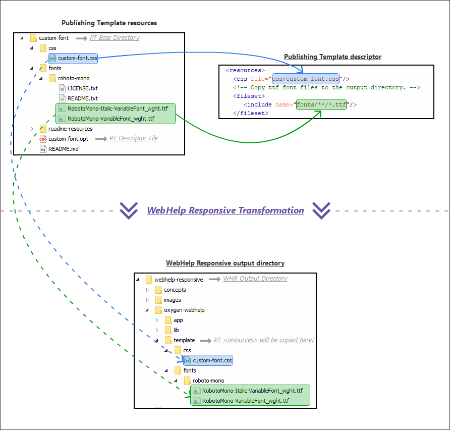

# How to Use a Local Font in WebHelp Responsive

## Objectives:
1. Copy font file to the output directory
2. Reference font file in custom CSS to declare a font face
3. Apply the custom font on the WebHelp Responsive output

WebHelp Responsive provides support for [customizing](https://www.oxygenxml.com/doc/versions/24.1/ug-webhelp-responsive/topics/wh-responsive-customization-tips.html) the output using a Publishing Template.

The WebHelp output can be styled using a [custom CSS](https://www.oxygenxml.com/doc/versions/24.1/ug-webhelp-responsive/topics/webhelp-customizing-with-css.html) file and additional resources can be copied in the output directory.

Using this support you can copy a local font file to the output directory and reference it in a custom CSS file to apply the font.


## Procedure:
### 1. **Add the font files in your Publishing Template.**
  ```
  fonts/roboto-mono/RobotoMono-Italic-VariableFont_wght.ttf
  fonts/roboto-mono/RobotoMono-VariableFont_wght.ttf
  ```
### 2. **Configure WebHelp Responsive to copy the font file in the output directory.**
  In the *&lt;resources>* section of your Publishing Template's descriptor file define a *&lt;fileset>* that matches the location of the font files (`fonts/**/*.ttf`).
  ```xml
  <resources>
    <!-- Copy ttf font files to the output directory. -->
    <fileset>
       <include name="fonts/**/*.ttf"/>
    </fileset>
  </resources>
  ```
  All the files matched by this fileset will be copied in the output directory.
  The additional resources will be copied in the following subfolder of the output directory:
  ```
  {OUTPUT-DIR}/oxygen-webhelp/template/
  ```
### 3. **Create a custom CSS file in your Publishing Template directory.** 
  ```
  css/custom-font.css
  ```
### 4. **Reference the CSS file in the *`&lt;resources>`* section of the Publishing Template's descriptor file.**
  This way the CSS file will be referenced in each HTML page of the WebHelp Responsive output.
  ```xml
  <resources>
    <css file="css/custom-font.css"/>
    <!-- ... -->
  </resources>
  ```
### 5. **Add *`@font-face`* definitions that reference the custom font files in your CSS file**.
  ```css
  @font-face {
    font-family: 'Roboto Mono';
    font-style: normal;
    src: url('../fonts/roboto-mono/RobotoMono-VariableFont_wght.ttf') format('truetype');
  }
  @font-face {
    font-family: 'Roboto Mono';
    font-style: italic;
    src: url('../fonts/roboto-mono/RobotoMono-Italic-VariableFont_wght.ttf') format('truetype');
  }
  ```
### 6. **Add a CSS rule that applies the custom font on all elements**.
  ```css
  body {
    font-family: 'Roboto Mono',sans-serif;
  }
  ```
