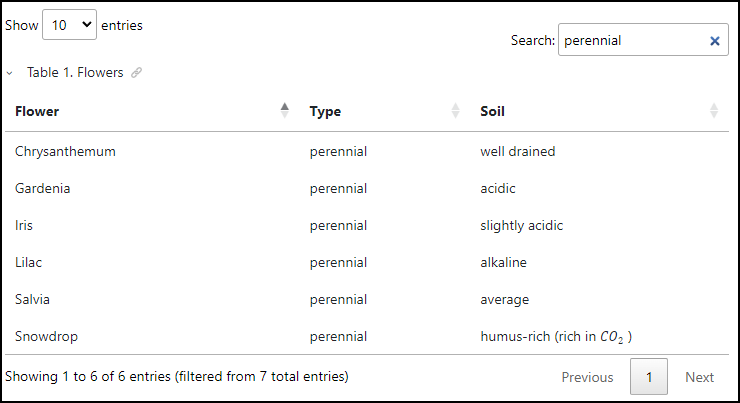

# *DataTables* JQuery Plug-in

This is a sample publishing template that customizes the WebHelp tables using the *[DataTables](https://datatables.net/)* JQuery plug-in. 
*DataTables* is a third party JavaScrip library available at: [https://datatables.net/](https://datatables.net/)
It adds sorting and filtering capabilities to HTML tables:



The template uses an [HTML Fragment](https://www.oxygenxml.com/doc/versions/25.1/ug-webhelp-responsive/topics/wh-add-custom-html.html) that contains the Javascript and CSS references for the *DataTables* library.

The HTML Fragment:
```xml
<html>
    <head>
        <!-- The DataTables library (for local use please uncomment the following lines) -->
        <!--<link rel="stylesheet" type="text/css" href="${oxygen-webhelp-template-dir}/DataTables/datatables.min.css"/>-->
        <!--<script src="${oxygen-webhelp-template-dir}/DataTables/jquery.dataTables.min.js" defer="true"/>-->
        <link rel="stylesheet" type="text/css"
            href="http://cdn.datatables.net/1.13.4/css/jquery.dataTables.min.css" />
        <script src="http://cdn.datatables.net/1.13.4/js/jquery.dataTables.min.js" defer="true"/>
        <script>
        <!--
            window.addEventListener("DOMContentLoaded", (event) => {
                $('.table').DataTable();
            });
        //-->
        </script>
    </head>
</html>

```

## How to use the Customization

To use this customization in your custom Publishing Template you must perform the following steps:

1. Copy the *html-fragments/data-tables-script-fragment.xml* file in your template's base directory
1. Reference the XML file in the *&lt;html-fragments>* section of your template's descriptor file (*opt*):
    ```
    <html-fragments>
       <fragment placeholder="webhelp.fragment.head" file="html-fragments/data-tables-script-fragment.xml"/>
    </html-fragments>
    ```
1. Optionally, you may copy the *tiles.css* file and reference it in the *&lt;css>* section of your *opt* file. Alternatively you can copy the CSS rules from *tiles.css* into your template's CSS file.

**Note:** If you haven't created a Publishing Template yet, you can create one by following the procedure described in [this topic](https://www.oxygenxml.com/doc/versions/25.0/ug-webhelp-responsive/topics/whr-create-publishing-template-x.html).


