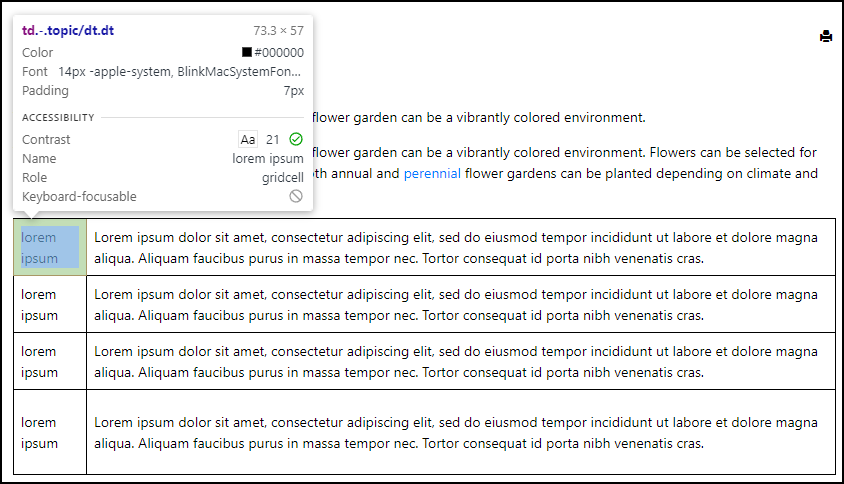

# Display Definition Lists as Tables

This is a sample publishing template that customizes the HTML structure generated from a DITA definition list (*dl*) to display its contents as table.

**Note:** The *dlentries* in a DITA *dl* should be balanced (they should have similar number of *dds* and *dts*) in order to have a balanced table (that has the same number of cells on each row).
The DITA *dl* is transformed into an HTML table as follows:

- Each *dl* generates a table element
- Each *dlentry* generates a table row (*tr*)
- Each *dl* or *dt* generates a table cell (*td*)




The template uses an [XSLT Extension](https://www.oxygenxml.com/doc/versions/25.0/ug-webhelp-responsive/topics/whr-responsive-override-xslt-dita-xslt-import.html) file to transform a DITA definition list into an HTML table.
```
<?xml version="1.0" encoding="UTF-8"?>
<xsl:stylesheet xmlns:xsl="http://www.w3.org/1999/XSL/Transform"
    xmlns:xs="http://www.w3.org/2001/XMLSchema"
    exclude-result-prefixes="xs"
    version="2.0">
    
    <xsl:template match="*[contains(@class, ' topic/dl ')]">
        <xsl:call-template name="setaname"/>
        <xsl:apply-templates select="
            *[contains(@class,
            ' ditaot-d/ditaval-startprop ')]" mode="out-of-line"/>
        <!-- Wrap in a table -->
        <table>
            <xsl:call-template name="commonattributes"/>
            <xsl:call-template name="setid"/>
            <xsl:apply-templates/>
        </table>
        <xsl:apply-templates select="
            *[contains(@class,
            ' ditaot-d/ditaval-endprop ')]" mode="out-of-line"/>
    </xsl:template>
    
    <xsl:template match="*[contains(@class, ' topic/dlentry ')]">
        <!-- Wrap in a table row -->
        <tr>
            <xsl:call-template name="commonattributes"/>
            <xsl:call-template name="setidaname"/>
            <xsl:apply-templates/>
        </tr>
    </xsl:template>
    
    <xsl:template match="
        *[contains(@class, ' topic/dd ')] |
        *[contains(@class, ' topic/dt ')]">
        <!-- Wrap in a cell -->
        <td>
            <xsl:call-template name="commonattributes"/>
            <xsl:call-template name="setidaname"/>
            <xsl:apply-templates select="
                ../*[contains(@class,
                ' ditaot-d/ditaval-startprop ')]" mode="out-of-line"/>
            <xsl:apply-templates/>
            <xsl:apply-templates select="
                ../*[contains(@class,
                ' ditaot-d/ditaval-endprop ')]" mode="out-of-line"/>
        </td>
    </xsl:template>
    
</xsl:stylesheet>
```


The Publishing Template also uses a custom CSS file (`dl-as-table.css`) to style the generated table.
```
td {
  border: 1px solid;
}
```

## How to use the Customization

To use this customization in your Publishing Template you must perform the following steps:

1. Copy the *xslt/dl-as-table.xsl* file in your template's base directory
1. Reference the XSL file in the *&lt;xslt>* section of your template's descriptor file (*opt*):
    ```
    <xslt>
        <extension file="xslt/dl-as-table.xsl" id="com.oxygenxml.webhelp.xsl.dita2webhelp"/>
    </xslt>
    ```
1. Copy the *dl-as-table.css* file and reference it in the *&lt;css>* section of your *opt* file. Alternatively you can copy the CSS rules from *dl-as-table.css* into your template's CSS file.

**Note:** If you haven't created a Publishing Template yet, you can create one by following the procedure described in [this topic](https://www.oxygenxml.com/doc/versions/25.0/ug-webhelp-responsive/topics/whr-create-publishing-template-x.html).


