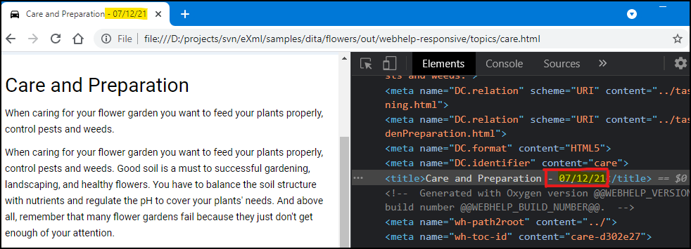

# Generation Date in each Topic Page Title

This is a sample publishing template that appends the generation date in the `head/title` element of each topic page.



It uses an 
[XSLT Extension](https://www.oxygenxml.com/doc/versions/23.1/ug-webhelp-responsive/topics/whr-responsive-override-xslt-dita-xslt-import.html) File to insert the generation date in the page title.

The XSLT extension:
```xml
<?xml version="1.0" encoding="UTF-8"?>
<xsl:stylesheet xmlns:xsl="http://www.w3.org/1999/XSL/Transform"
    xmlns:xs="http://www.w3.org/2001/XMLSchema"
    xmlns:oxyf="http://www.oxygenxml.com/functions"
    exclude-result-prefixes="xs"
    version="2.0">
    
    <!-- Topic page title -->
    <xsl:template match="/*[contains(@class, ' topic/topic ')]/*[contains(@class, ' topic/title ')]"
        mode="text-only">
        <!-- Apply the default processing -->
        <xsl:next-match/> -
        <xsl:call-template name="formatted-date"/>
    </xsl:template>
    
    <xsl:template name="formatted-date">
        <xsl:value-of select="format-date(current-date(), '[M01]/[D01]/[Y01]')"/>
    </xsl:template>
</xsl:stylesheet>

```


