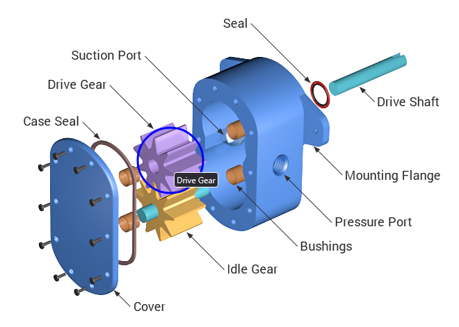

# Change Image Map Hightlight
This is a sample Publishing Template that changes image maps highlights fill and stroke colors.

## The HTML Fragment
The template inserts a custom [HTML fragment](https://www.oxygenxml.com/doc/ug-webhelp-responsive/topics/wh-add-custom-html.html) before the topic content. The HTML fragment imports a JavaScript file changing the colors:
```javascript
document.addEventListener("DOMContentLoaded", function () {
  if ($.fn.maphilight) {
    $.fn.maphilight.defaults = $.extend($.fn.maphilight.defaults, {
      fillColor: 'ffffff',
      fillOpacity: 0,
      strokeColor: '0000ff',
      strokeWidth: 3
      /*stroke: false*/
    });
  }
});
```

The result is a wider blue line around the selected area:

