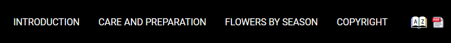

# Link to PDF
This is a sample Publishing Template adding a link to the PDF version of the online help in the top menu.



It uses an [HTML fragment](https://www.oxygenxml.com/doc/ug-webhelp-responsive/topics/wh-add-custom-html.html) displayed after WebHelp's top menu.

The HTML fragment ([fragments/after-menu.xml](fragments/after-menu.xml)) consists in a link with an image based on the original `webhelp.pdf.link.text`, `webhelp.pdf.link.url` and `webhelp.pdf.link.icon.path` parameters values.

Of course it is possible to add another parameter (e.g. `webhelp.main.pdf.link.url`) if you want the top menu PDF to point to another file, while the default `webhelp.pdf.link.url` present in the topics will still open the PDF help.

It also includes a custom CSS stylesheet ([custom.css](custom.css)) styling the inserted fragment:
```css
.pdf-link-container {
  display: inline-block;
  vertical-align: middle;
  font-size: 0.9em;
}
```
