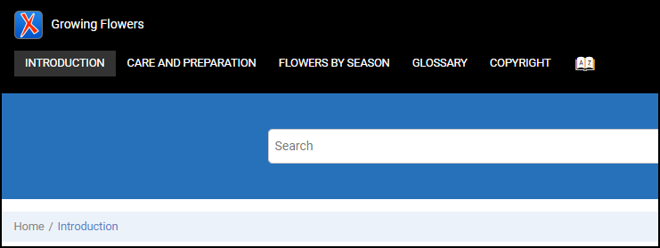

# Logo and Title above the Menu

This is a sample Publishing Template that Uses custom CSS styles to place the Logo and Title components above the menu.

## Output sample:



## The custom CSS: 
```css
.wh_header_flex_container {
    flex-direction: column;
    align-items: flex-start;
    justify-content: flex-start;
}
.wh_header_flex_container > * {
    width: 100%;
}
@media only screen and (min-width : 768px) {
    .wh_top_menu_and_indexterms_link.navbar-collapse {
        display: flex !important;
    }
}

.wh_logo_and_publication_title_container {
    display: flex;
    justify-content: flex-start;
}

.wh_logo, .wh_publication_title {
    padding-right: 10px;
}
```


