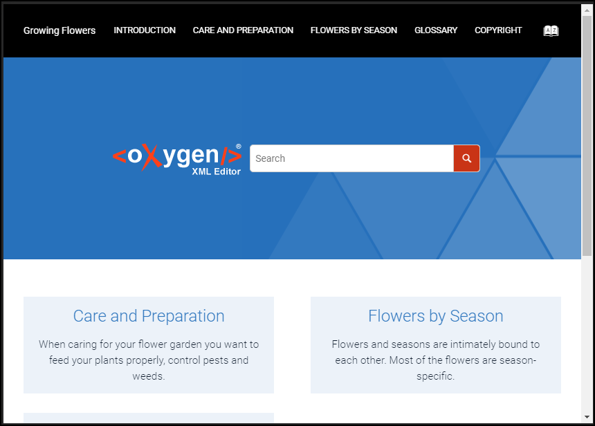

# Logo Before Search Template

This is a sample publishing template that displays the [Logo component](https://www.oxygenxml.com/doc/versions/22.1/ug-webhelp-responsive/topics/webhelp-customization-add-image-to-title.html) before the search input.



It uses an 
[XSLT Extension](https://www.oxygenxml.com/doc/versions/22.1/ug-webhelp-responsive/topics/whr-responsive-override-xslt-dita-xslt-import.html) File to customize the structure of the `search component`.

The XSLT extension removes the Logo component from the default location (page header) and inserts it before the search input. 

The XSLT extension:
```
<xsl:stylesheet xmlns:xsl="http://www.w3.org/1999/XSL/Transform"
    xmlns:xs="http://www.w3.org/2001/XMLSchema"
    xmlns:math="http://www.w3.org/2005/xpath-functions/math"
    xmlns:whc="http://www.oxygenxml.com/webhelp/components"
    exclude-result-prefixes="xs math"
    version="3.0">
    
    <xsl:template match="whc:webhelp_search_input" mode="copy_template">
        <xsl:variable name="searchComponent">
            <xsl:next-match/>
        </xsl:variable>
        <xsl:apply-templates select="$searchComponent" mode="copy_search"/>
    </xsl:template>
    
    <!-- Templates used to post process the content of the search component -->
    <xsl:template match="*[@id='searchForm']/*:div" mode="copy_search">
        <xsl:copy>
            <xsl:apply-templates select="@*" mode="copy_search"/>
            <xsl:call-template name="generateLogoComponent"/>
            <span class="input_container">
                <xsl:apply-templates select="node()" mode="copy_search"/>
            </span>
        </xsl:copy>
    </xsl:template>
    
    <xsl:template match="node() | @*" mode="copy_search">
        <xsl:copy>
            <xsl:apply-templates select="node() | @*" mode="copy_search"/>
        </xsl:copy>
    </xsl:template>
    
    <!-- Template used to regenerate the overidden Logo component  -->
    <xsl:template name="generateLogoComponent">
        <xsl:variable name="artificialLogo">
            <whc:webhelp_logo class="d-none d-sm-block"/>
        </xsl:variable>
        <span class="logo_container">
            <xsl:apply-templates select="$artificialLogo/*"  mode="copy_template"/>
        </span>
    </xsl:template>
    
    <!-- Replace the default Logo component -->
    <xsl:template match="*:header//whc:webhelp_logo" mode="copy_template"/>
</xsl:stylesheet>
```

The Publishing Template also uses a custom CSS file (`additional.css`) to layout the logo component next to the search input:
```
#searchForm > div {
    display: flex;
    align-items: center;
}

.logo_container {
    padding: 0 10px;
}

.input_container {
    width:100%;
}

.wh_search_button {
    top: initial;
}
```


