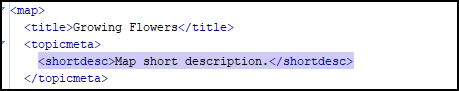
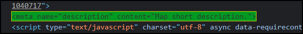

# Main page description meta

This is a sample publishing template that generates a "description" meta in the WebHelp's main page from the DITA Map's 'shortdesc'.


- &lt;shortdesc> in DITA Map: 
  
- `description` meta in WebHelp output: 
  


It uses an [HTML Fragment](https://www.oxygenxml.com/doc/versions/23.1/ug-webhelp-responsive/topics/whr_publishing_template_contents.html#html_fragment_extension_points) file [to insert custom HTML content](https://www.oxygenxml.com/doc/versions/23.1/ug-webhelp-responsive/topics/wh-add-custom-html.html) in the <head> element of the WebHelp's main page. 
The HTML Frgament file uses [a map-xpath macro](https://www.oxygenxml.com/doc/versions/23.1/ug-webhelp-responsive/topics/wh-add-custom-html.html#wh-add-custom-html__d137e166) to extract the short description from the main DITA map. 

The HTML Fragment:
```
<meta name="description" content="${map-xpath(/map/topicmeta/shortdesc)}"/>
```


