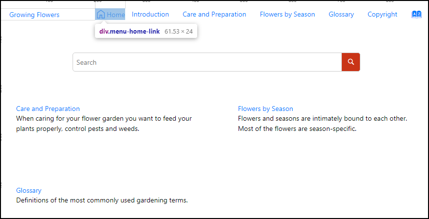

# 'Home' link before the menu bar

This is a sample publishing template that uses the [HTML Fragments](https://www.oxygenxml.com/doc/versions/25.0/ug-webhelp-responsive/topics/wh-add-custom-html.html) support to display a 'Home' link before the menu bar.



The template contributes two HTML fragments:
1. One for inserting the 'Home' link before the menu bar (*html-fragments/menu-home-link.xml*):
    ```
    <div class="menu-home-link">
        <a href="${oxygen-webhelp-output-dir}/index.html">
            <span class="home-link-icon material-symbols-outlined"> home </span>
            <span class="home-link-label">Home</span>
        </a>
    </div>
    ```
    **Note:** For the link location (*@href*) we have used the `oxygen-webhelp-output-dir` [WebHelp Macro](https://www.oxygenxml.com/doc/versions/25.0/ug-webhelp-responsive/topics/wh-add-custom-html.html#wh-add-custom-html__using_webhelp_macros_inside_a_html_fragment_file) that expands to the path of the WebHelp output directory relative to the path of the current page.
1. One for inserting a reference to the Google's [Material Symbols](https://fonts.google.com/icons) font that will render the icon for the Home link (*html-fragments/material-symbols-icon-font.xml*):
    ```
    <link rel="stylesheet" href="https://fonts.googleapis.com/css2?family=Material+Symbols+Outlined:opsz,wght,FILL,GRAD@48,400,0,0" />
    ```


The Publishing Template also uses a custom CSS file (`menu-home-link.css`) to align the Home link with the menu entries.
```
@media only screen and (min-width : 768px) {
    .wh_top_menu_and_indexterms_link.navbar-collapse {
        align-content: center;
        align-items: center;
        display: flex !important;
        flex-wrap: nowrap;
        justify-content: flex-end;
    }
}

.menu-home-link > a {
    display: flex;
    align-items: center;
}
```

## How to use the Customization

To use this customization in your custom Publishing Template you must perform the following steps:

1. Copy the *html-fragments/* folder in your template's base directory
1. Reference the HTML Frgments XML files in the *&lt;html-fragments>* section of your template's descriptor file (*opt*):
    ```
    <html-fragments>
        <fragment placeholder="webhelp.fragment.before.top_menu" file="html-fragments/menu-home-link.xml"/>
        <fragment placeholder="webhelp.fragment.head" file="html-fragments/material-symbols-icon-font.xml"/>
    </html-fragments>
    ```
1. Optionally, you may copy the *menu-home-link.css* file and reference it in the *&lt;css>* section of your *opt* file. Alternatively you can copy the CSS rules from *menu-home-link.css* into your template's CSS file.

**Note:** If you haven't created a Publishing Template yet, you can create one by following the procedure described in [this topic](https://www.oxygenxml.com/doc/versions/25.0/ug-webhelp-responsive/topics/whr-create-publishing-template-x.html).


