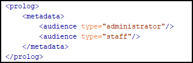
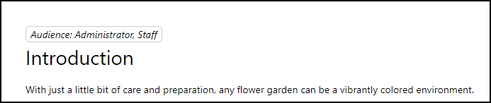

# Insert Multiple Topic Meta before Topic Title
**_(!) Note:_** _This template requires Oxygen WebHelp 23.1 or later._

This is a sample Publishing Template that extracts a given topic meta (e.g.: `audience`) from the topic's `prolog` section and inserts it as a `div` in the output HTML file, before the topic's title.

## Input sample: 


## Output sample:


## The HTML Fragment
The template inserts a custom [HTML fragment](https://www.oxygenxml.com/doc/versions/25.0/ug-webhelp-responsive/topics/wh-add-custom-html.html) before the topic's content. The HTML fragment uses the `topic-xpath` [WebHelp Responsive Macro](https://www.oxygenxml.com/doc/versions/25.0/ug-webhelp-responsive/topics/whr_publishing_template_contents.html#ariaid-title7) in order to query the current topic for a certain `metadata`. 
In this case it looks for the `audience` metadata. If there are multiple `audience` entries, then all their values are emitted in the output. 

The [HTML Fragment file](customization/fragments/topic-meta.xml):
```xml
<div class="audience-container" xmlns:whc="http://www.oxygenxml.com/webhelp/components">
    <div class="${topic-xpath(if (count(/*/prolog/metadata/audience) gt 0) then 'audience' else 'audience none')}" >
        <whc:macro value="${topic-xpath(string-join(/*/prolog/metadata/audience/@type, ', '))}"/>
    </div>
</div>
```

The HTML fragment is bound on the `webhelp.fragment.before.topic.content` placeholder (see the [`*.opt`](multiple-topic-meta-in-body.opt) file):

**_(!) Note:_** _The `webhelp.fragment.before.topic.content` parameter is available starting with version 23.1 of Oxygen WebHelp._

```xml
<html-fragments>
    <fragment placeholder="webhelp.fragment.before.topic.content" file="customization/fragments/topic-meta.xml"/>
</html-fragments>
```

The HTML resulted in output:
```xml
<div class="audience-container">
    <div class="audience"> administrator, staff </div>
</div>
```

## The custom CSS: 

The template uses a custom CSS to apply styling on the additional HTML content.

```css
.audience-container {
    display: flex;
    justify-content: start;
}
.audience.none {
    display:none;
}

.audience {
  display: block;
  font-style: italic;
  padding: 0 6px;
  border-radius: 6px;
  border: 1px solid #ccc;
  text-transform: capitalize;
}

.audience::before {
  content: "Audience: ";
}
```


