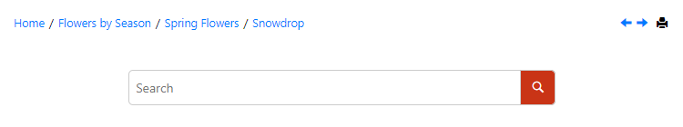

# Search Input after Topic Breadcrumb

This is a sample publishing template that moves the search input after the breadcrumb in the topics pages.

The customization contains two layers:
 
1. A custom [HTML Fragment](https://www.oxygenxml.com/doc/versions/25.1/ug-webhelp-responsive/topics/wh-add-custom-html.html#wh-add-custom-html__the_xml_file) that inserts the search input after the topic breadcrumb. The fragment is linked with the `webhelp.fragment.after.topic.toolbar` placeholder.
1. An XSLT extension that inhibits the generation of the search input in the default location. The XSLT extension is only executed for topic pages.




The HTML Fragment (`fragments/after-breadcrumb-fragment.xml`):
```xml
<whc:webhelp_search_input  xmlns:whc="http://www.oxygenxml.com/webhelp/components" class="navbar-form wh_topic_page_search search" role="form">
    <whc:include_html href="${webhelp.fragment.before.search.input}"/>
    <whc:include_html href="${webhelp.fragment.before.search.input.topic.page}"/>
    
    <whc:component_content/>
    
    <whc:include_html href="${webhelp.fragment.after.search.input}"/>
    <whc:include_html href="${webhelp.fragment.after.search.input.topic.page}"/>
</whc:webhelp_search_input>

```

The XSLt extension (`xsl/search-after-breadcrumb.xsl`)
```xml
<?xml version="1.0" encoding="UTF-8"?>
<xsl:stylesheet xmlns:xsl="http://www.w3.org/1999/XSL/Transform"
    xmlns:whc="http://www.oxygenxml.com/webhelp/components"
    version="3.0">
    
    <xsl:template match="*:body[contains(@class, 'wh_topic_page')]/whc:webhelp_search_input" mode="copy_template">
        <xsl:param name="i18n_context" tunnel="yes" as="element()*"/>
        <!-- Do not generate the search input in the default location -->
    </xsl:template>
</xsl:stylesheet>
```

The Publishing Template also uses a custom CSS file (`search.css`) to style the search input below the breadcrumb:
```css
.wh_tools {
  flex-wrap: wrap;
}

.wh_tools > .wh_search_input {
  width: 100%;
}
```

## How to use the Customization

To use this customization in your Publishing Template you must perform the following steps:

1. Copy the *fragments/after-breadcrumb-fragment.xml* file in the *fragments* sub-folder of your template's base directory
1. Reference the file in the *&lt;html-fragments>* section of your template's descriptor file (*opt*):
    ```xml
    <html-fragments>
        <fragment file="fragments/after-breadcrumb-fragment.xml" placeholder="webhelp.fragment.after.topic.toolbar"/>
    </html-fragments>
    ```
1. Copy the *xsl/search-after-breadcrumb.xsl* file in the *xsl* sub-folder of your template's base directory
1. Reference the file in the *&lt;xslt>* section of your template's descriptor file (*opt*):
    ```xml
    <xslt>
        <extension file="xsl/search-after-breadcrumb.xsl" id="com.oxygenxml.webhelp.xsl.dita2webhelp"/>
    </xslt>
    ```    
1. Copy the *search.css* file and reference it in the *&lt;css>* section of your *opt* file. Alternatively you can copy the CSS rules from *search.css* into your template's CSS file.

**Note:** If you haven't created a Publishing Template yet, you can create one by following the procedure described in [this topic](https://www.oxygenxml.com/doc/versions/25.1/ug-webhelp-responsive/topics/whr-create-publishing-template-x.html).

