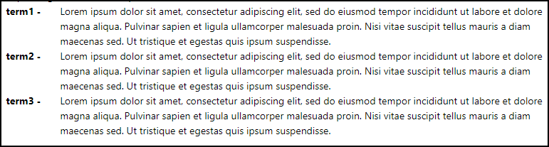

# Single Line dlentry (dd & dt)

This is a sample publishing template that customizes the layout of a <dl> section to display each pair of <dt> & <dd> on a single line.



The Publishing Template uses a custom CSS file (`single-line-dlentry.css`) to adjust the layout of the <dl> section.
```css
dl {
  display:flex;
  justify-content: flex-start;
  flex-wrap: wrap;
  box-sizing: content-box;
}
.dt {
  width: 10%;
  margin: 0;
  
}

.dt::after {
  content: " - "
}

.dd {
  width: 90%;
  margin-left: 0;
  margin-bottom: 0;
}
```

## How to use the Customization

To use this customization in your Publishing Template you must copy the *single-line-dlentry.css* file and reference it in the *&lt;css>* section of your *opt* file. Alternatively you can copy the CSS rules from *single-line-dlentry.css* into your template's CSS file.

**Note:** If you haven't created a Publishing Template yet, you can create one by following the procedure described in [this topic](https://www.oxygenxml.com/doc/versions/25.0/ug-webhelp-responsive/topics/whr-create-publishing-template-x.html).


