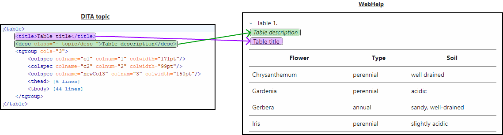

# Swap table title and description

This is a sample publishing template that swaps the title and the description of a table.



It uses an 
[XSLT Extension](https://www.oxygenxml.com/doc/versions/24.1/ug-webhelp-responsive/topics/whr-responsive-override-xslt-dita-xslt-import.html) file to change the order of the table title and the table description.

The XSLT extension:
```xml
<xsl:stylesheet xmlns:xsl="http://www.w3.org/1999/XSL/Transform"
    xmlns:xs="http://www.w3.org/2001/XMLSchema"
    exclude-result-prefixes="xs"
    version="3.0">
    
    <xsl:template match="*[contains(@class, ' topic/table ')][child::*[contains(@class, ' topic/title ')]][child::*[contains(@class, ' topic/desc ')]]/*[contains(@class, ' topic/title ')]">
        <xsl:param name="swap" as="xs:boolean" select="true()"/>
        <xsl:choose>
            <xsl:when test="$swap">
                <xsl:apply-templates select="parent::*[contains(@class, ' topic/table ')]/*[contains(@class, ' topic/desc ')]">
                    <xsl:with-param name="swap" select="false()"/>
                </xsl:apply-templates>
            </xsl:when>
            <xsl:otherwise>
                <xsl:next-match/>
            </xsl:otherwise>
        </xsl:choose>
    </xsl:template>
    
    <xsl:template match="*[contains(@class, ' topic/table ')][child::*[contains(@class, ' topic/title ')]][child::*[contains(@class, ' topic/desc ')]]/*[contains(@class, ' topic/desc ')]">
        <xsl:param name="swap" as="xs:boolean" select="true()"/>
        <xsl:choose>
            <xsl:when test="$swap">
                <xsl:apply-templates select="parent::*[contains(@class, ' topic/table ')]/*[contains(@class, ' topic/title ')]">
                    <xsl:with-param name="swap" select="false()"/>
                </xsl:apply-templates>
            </xsl:when>
            <xsl:otherwise>
                <xsl:next-match/>
            </xsl:otherwise>
        </xsl:choose>
    </xsl:template>
</xsl:stylesheet>
```


