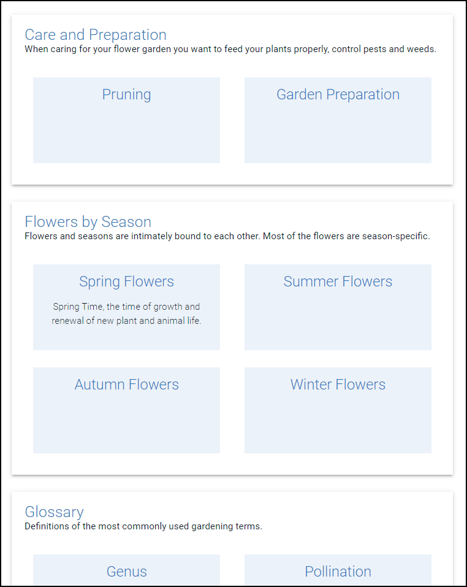
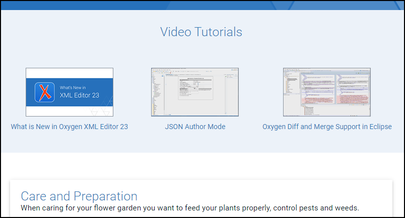
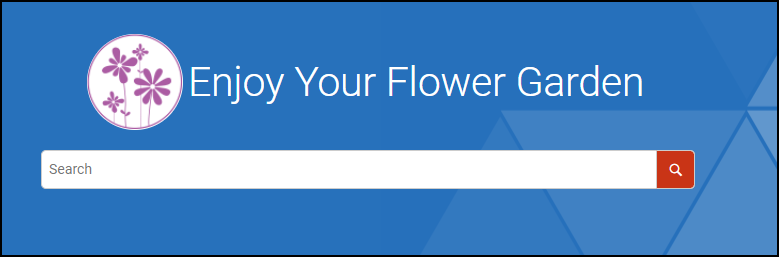

# Tiles Groups

Displays the tiles on the main page grouped in sections.
The groups are determined by the topics on the filst level in the DITA Map and the tiles are determined from the topics on the second level.This is a sample publishing template that moves the *Search Input* component from its default location to the header section of each output page.



It uses an 
[XSLT Extension](https://www.oxygenxml.com/doc/versions/23.1/ug-webhelp-responsive/topics/whr-responsive-override-xslt-dita-xslt-import.html) File to change the structure generated for the Tiles component.

The XSLT extension overrides the default processing for the Tiles component that would have generated a tile for each top-level topic.
Instead of this it generates group of tiles for each top level topic with the topic title acting as header for the tiles group.
The tiles in each group are generated from the second level topics.

The XSLT extension:
*customization/xsl/tile-groups.xsl*
```xml
<?xml version="1.0" encoding="UTF-8"?>
<xsl:stylesheet xmlns:xsl="http://www.w3.org/1999/XSL/Transform"
    xmlns:xs="http://www.w3.org/2001/XMLSchema"
    xmlns:whc="http://www.oxygenxml.com/webhelp/components"
    xmlns:toc="http://www.oxygenxml.com/ns/webhelp/toc"
    xmlns:oxygen="http://www.oxygenxml.com/functions"
    exclude-result-prefixes="xs whc toc oxygen"
    version="3.0">
    <xsl:template match="/toc:toc/toc:topic[oxygen:isTileVisible(.)]" mode="create-tiles">
        <xsl:param name="tileTemplate"/>
        <div class="tiles-group">
            <xsl:call-template name="generateGroupHeader">
                <xsl:with-param name="tileTemplate" select="$tileTemplate"/>
            </xsl:call-template>
            <xsl:if test="count(toc:topic[oxygen:isTileVisible(.)]) > 0">
                <div class="tiles-group-content">
                    <xsl:apply-templates select="toc:topic[oxygen:isTileVisible(.)]" mode="#current">
                        <xsl:with-param name="tileTemplate" select="$tileTemplate"/>
                    </xsl:apply-templates>
                </div>
            </xsl:if>
        </div>
    </xsl:template>
    
    <xsl:template name="generateGroupHeader">
        <xsl:param name="tileTemplate"/>
        <div class="tiles-group-header">
            <!-- Generate the default tile content in a variable for further processing. -->
            <xsl:variable name="defaultTile">
                <xsl:next-match>
                    <xsl:with-param name="tileTemplate" select="$tileTemplate"/>
                </xsl:next-match>
            </xsl:variable>
            <!-- Copy the id of the associated dita topic -->
            <xsl:copy-of select="$defaultTile//@data-id"/>

            <!-- Copy the title of the associated dita topic -->
            <xsl:apply-templates select="$defaultTile//*[contains(@class, 'wh_tile_title')]"
                mode="copy-header"/>
            <!-- Copy the shortdesc of the associated dita topic -->
            <xsl:apply-templates select="$defaultTile//*[contains(@class, 'wh_tile_shortdesc')]"
                mode="copy-header"/>

        </div>
    </xsl:template>
    
    <xsl:template match="*[contains(@class, 'wh_tile_title')]" priority="20" mode="copy-header">
        <div class="tiles-group-title">
            <xsl:apply-templates mode="#current"/> 
        </div>  
    </xsl:template>
    <xsl:template match="*[contains(@class, 'wh_tile_shortdesc')]" priority="15" mode="copy-header">
        <div class="tiles-group-shortdesc">
            <xsl:apply-templates mode="#current"/> 
        </div>  
    </xsl:template>
    
    <xsl:template match="node() | @*" mode="copy-header" priority="10">
        <xsl:copy>
            <xsl:apply-templates select="node() | @*" mode="#current"/>
        </xsl:copy>
    </xsl:template>
    
    <!-- Test if a tile will be outputed for a topic -->
    <xsl:function name="oxygen:isTileVisible" as="xs:boolean">
        <xsl:param name="cTopic"/>
        <!-- Defined in com.oxygenxml.webhelp.responsive/xsl/template/mainPageComponentsExpander.xsl -->
        <xsl:sequence select="oxygen:shouldDisplayTile($cTopic)"/>
    </xsl:function>
</xsl:stylesheet>
```

The Publishing Template also uses a [custom CSS](https://www.oxygenxml.com/doc/versions/23.1/ug-webhelp-responsive/topics/webhelp-customizing-with-css.html) file for styling the generated HTML structure (`customization/css/tiles-groups.css`) to adjust the layout the *Search Input* component and make it fit into the header section:
```css
.tiles-group {
    display: flex;
    flex-direction: column;
    width: 100%;
    
    box-shadow: 0px 3px 3px -2px rgba(0,0,0,0.2),0px 3px 4px 0px rgba(0,0,0,0.14),0px 1px 8px 0px rgba(0,0,0,0.12);
    padding: 1.5em;
    margin: 1em;
}


.tiles-group-content {
    margin-top: 1.5em;
    display: flex;
    flex-direction: row;
    justify-content: space-between;
    align-items: stretch;
    align-content: stretch;
    flex-wrap: wrap;
    width: 100%;
}

.tiles-group-title {
    font-size: 1.8em;
    font-weight: 300;
}

.tiles-group-shortdesc {
    color: #0D1A2B;
    font-size: 1.1em;
}
```

## Other customization layers

In addition to the XSLT extension that generates the tiles groups, this template also contributes two HTML fragments to the Main Page:
 - one for inserting a list of links to Video Tutorials above the tiles component
 - one for inserting an additional Logo and Title Message (welcome fragment) above the serch input 
You can find more details about inserting HTML content in output [in this topic](https://www.oxygenxml.com/doc/versions/23.1/ug-webhelp-responsive/topics/wh-add-custom-html.html).

Each HTML Fragment is acompanied by an additional CSS that contributes the styles for the inserted content.

### Video Tutorials



The HTML Fragment file (`customization/html-fragments/main-page-resources.xml`) is bound to the `webhelp.fragment.before.main.content.area.main.page` placeholder in the `<html-fragments>` section of the Publishing Template's descriptor file (`tiles-groups.opt`). 

```xml
 <fragment file="customization/html-fragments/main-page-resources.xml" 
                placeholder="webhelp.fragment.before.main.content.area.main.page"/>
```

*customization/html-fragments/main-page-resources.xml*:
```xml
<div class="videos-container">
    <div class="videos-header">Video Tutorials</div>
    <div class="videos-content">
        <div class="video">
            <a href="https://oxygenxml.com/demo/wn23.html" class="video-link" id="whats-new" target="_blank">
                <div class="video-preview">
                    
                </div>
                <div class="video-title">What is New in Oxygen XML Editor 23</div>
            </a>
        </div>
        <div class="video">
            <a href="https://oxygenxml.com/demo/json_author.html" class="video-link" id="json_author" target="_blank">
                <div class="video-preview">
                    
                </div>
                <div class="video-title">JSON Author Mode</div>
            </a>
        </div>
        <div class="video">
            <a href="https://oxygenxml.com/demo/diff_eclipse.html" class="video-link" id="diff_eclipse" target="_blank">
                <div class="video-preview">
                    
                </div>
                <div class="video-title">Oxygen Diff and Merge Support in Eclipse</div>
            </a>
        </div>
    </div>
</div>
```

**NOTE**: The above HTML Fragment file references several images used as preview images for the linked videos: 
 - They are located in the `customization/resources/img/preview/` directory. 
 - They are referenced in the HTML Fragment using relative paths prefixed with the `${oxygen-webhelp-template-dir}` [WebHelp Responsive Macro](https://www.oxygenxml.com/doc/versions/23.1/ug-webhelp-responsive/topics/wh-add-custom-html.html#wh-add-custom-html__using_webhelp_macros_inside_a_html_fragment_file) in order to corectly expand their path in the output HTML page.
 - In order for the above images to be copied in the WebHelp Responsive output directory the followinf fileset is declared in the `<resources>` section of the Publishing Template's descripto file (`tiles-groups.opt`):
    ```xml
    <fileset>
        <include name="customization/resources/**/*"/>
        <exclude name="customization/resources/**/*.svn"/>
        <exclude name="customization/resources/**/*.git"/>
    </fileset>
    ```
 
 
The styles used for the above HTML frgament can be found in `customization/css/video.css`:

```css
.videos-container {
    display: flex;
    flex-direction: column;
    align-items: center;
    background-color: #ECF2F9;
    margin-bottom: 1em;
}

.videos-header {
    font-size: 1.8em;
    padding: 1em 0;
    color: #337ab7;
    font-weight: 300;
}

.videos-content {
    display: flex;
    width: 100%;
    padding: 0.5em;
    align-items: center;
    justify-content: space-around;
    margin-bottom: 1em;
    flex-wrap: wrap;
}

.video-link {
    display: flex;
    flex-direction: column;
    align-items: center;
    padding: 20px;
}

.video-title {
    padding-top: 10px;
}
```

### Welcome Fragment (additional logo and title)



The HTML Fragment file (`customization/html-fragments/welcome.xml`) is bound to the `webhelp.fragment.welcome` placeholder in the `<html-fragments>` section of the Publishing Template's descriptor file (`tiles-groups.opt`):

```xml
<fragment file="customization/html-fragments/welcome.xml" 
  placeholder="webhelp.fragment.welcome"/>
 
```

*customization/html-fragments/welcome.xml*:
```xml
<div class="welcome">
    
    <div class="welcome-text">Enjoy Your Flower Garden</div>
</div>
```

The styles used for the above HTML frgament can be found in `customization/css/welcome.css`:

```css
.welcome {
    display: flex;
    align-items: center;
    flex-wrap: wrap;
    justify-content: center;
}

.welcome-logo {
    height: auto;
    max-width: 96px;
    background-color: #fff;
    border-radius: 50%;
}
.welcome-text {
    padding: 5px;
}

```

### Publication Logo

The publication logo image (`customization/resources/img/logo/publication_logo.png`) is referenced in the `<resources>` section of the Publishing Template's descriptor file (`tiles-group.opt`) as:

```xml
<logo file="customization/resources/img/logo/publication_logo.png"/>
```


