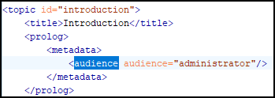
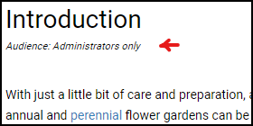

# Insert Topic Meta in HTML `<body>`

This is a sample Publishing Template that extratcs a given topic meta (e.g.: `audience`) from the topic's `prolog` section and inserts it as a `div` in the output HTML `body` element.

## Input sample: 


## Output sample:


## The HTML Fragment
The template inserts a custom [HTML fragment](https://www.oxygenxml.com/doc/versions/23.1/ug-webhelp-responsive/topics/wh-add-custom-html.html) at the begining of the HTML `body` element. The HTML fragment uses the `topic-xpath` [WebHelp Responsive Macro](https://www.oxygenxml.com/doc/versions/23.1/ug-webhelp-responsive/topics/whr_publishing_template_contents.html#ariaid-title7) in order to query the current topic for a certain `metadata`. In this case it looks for the `audience` metadata.

The [HTML Fragment file](customization/fragments/topic-meta.xml):
```xml
<div class="audience ${topic-xpath(/topic/prolog/metadata/audience[1]/@audience)}"/>
```

The HTML fragment is bound on the `webhelp.fragment.before.body` placeholder (see the [`*.opt`](topic-meta-in-body.opt) file):
```xml
<html-fragments>
    <fragment placeholder="webhelp.fragment.before.body" file="customization/fragments/topic-meta.xml"/>
</html-fragments>
```

The HTML resulted in output:
```xml
<html>
    ....
    <body>
        <div class="audience administrator"></div>
        ....
    <body>
<html>
```

## The custom CSS: 

The template uses a custom CSS to apply styling on the topic's title based on the available topic meta.

```css
.audience.administrator ~ #wh_topic_container .topictitle1::after{
  display: block;
  content: "Audience: Administrators only";
  font-size: .4em;
  font-style: italic;
}
```


