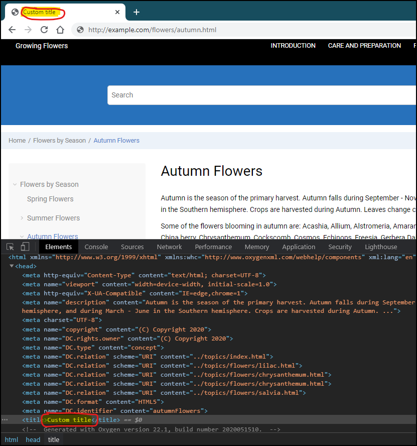

# Custom Static Title for Topic Pages

This is a sample publishing template that overrides the default `head/title` element for each topic page and generates a title element with custom static content.



It uses an 
[XSLT Extension](https://www.oxygenxml.com/doc/versions/22.1/ug-webhelp-responsive/topics/whr-responsive-override-xslt-dita-xslt-import.html) File to generate the custom page title.

The XSLT extension:
```
<xsl:stylesheet xmlns:xsl="http://www.w3.org/1999/XSL/Transform"
    xmlns:xs="http://www.w3.org/2001/XMLSchema"
    xmlns:math="http://www.w3.org/2005/xpath-functions/math"
    exclude-result-prefixes="xs math"
    version="3.0">
    
    <xsl:template name="generateChapterTitle">
        <title>Custom title</title>
    </xsl:template>
</xsl:stylesheet>
```


