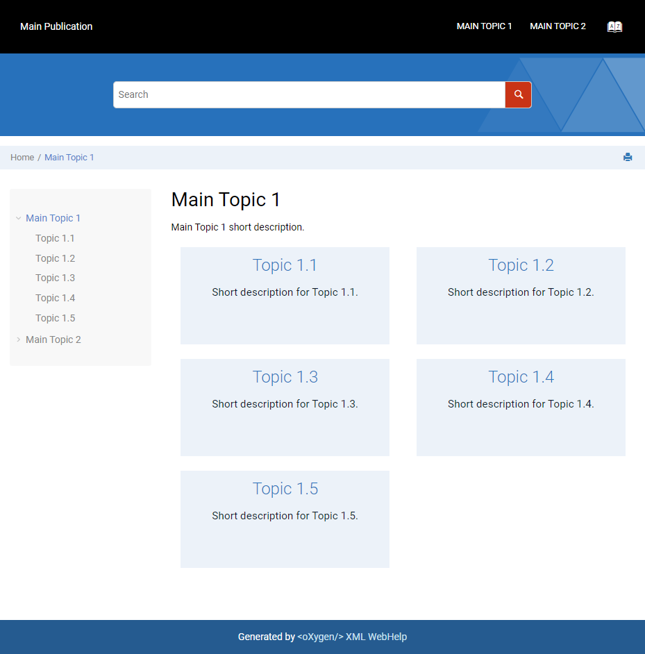

# Child Links as Tiles in Topic Pages

This is a sample Publishing Template that uses a custom CSS to layout the links to child topics from each topic as tiles similar with the ones from the main page.

## Prerequisites: 
To generate the _Child Links_ component you must set the _webhelp.show.child.links_ transformation parameter to _yes_. By default this component is not generated in the output. 

## Input sample: 

- [Single map sample](../../dita/topics-with-tiles/single-map/)
- [Multi-map smaple](../../dita/topics-with-tiles/multi-map/)

## Output sample:



## The custom CSS: 
```css
.wh_child_links {
    border: none;
    padding: 0;
}
.wh_child_links ul {
    list-style:none;
    display: flex;
    flex-direction: row;
    justify-content: space-between;
    align-items: stretch;
    align-content: stretch;
    flex-wrap: wrap;
}
.wh_child_links .link {
    margin: 1em;
    padding: 1em;
    width: 30%;
    min-width: 300px;
    min-height: 140px;
    background-color: #ECF2F9;
    font-weight: 400;
    font-size: 1em;
    margin-top: 0.5em;
    text-align: justify;
}
@media only screen and (max-width: 1200px) {
    .wh_child_links .link {
        width: 45%;
    }
}
@media only screen and (max-width: 767px) {
    .wh_child_links .link {
        width: 100%;
        min-width: 240px;
    }
}
.wh_child_links .link strong {
    display: block;
    width: 100%;
}
.wh_child_links .link a {
    display: block;
    width: 100%;
    font-weight: 300;
    text-decoration: none;
    text-transform: none;
    text-align: center;
    color: #3077be !important;
    font-size: 1.7em;
}
.wh_child_links .link .desc {
    margin-top: 1em;
    text-align: center;
    color: #0D1A2B;
    font-size: 1.1em;
}
```


