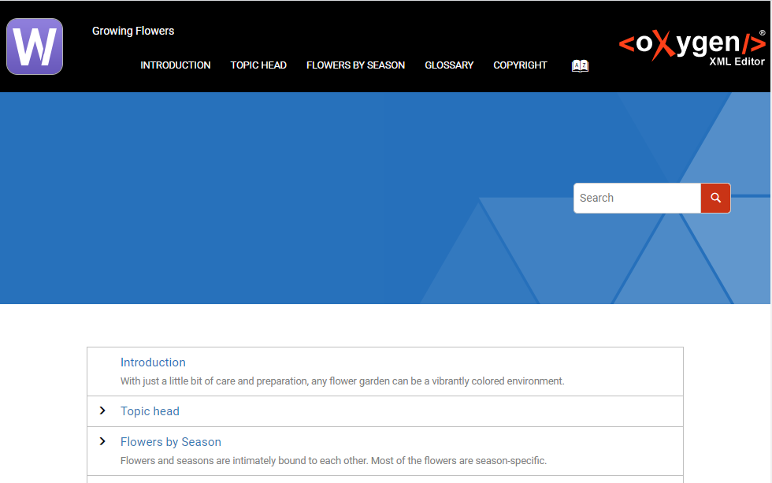

# Two Logos Temeplate
This template adds a logo image to each side of the HTML page header. 


For each logo you can configure the image path and the target URL usinga set of parameters defined in this Publishing Template's descriptor file:
```
<parameter name="template.left.logo.img" value="logos/left-logo.png"/>
<parameter name="template.left.logo.target.url" value="https://www.oxygenxml.com/xml_webhelp.html"/>

<parameter name="template.right.logo.img" value="logos/right-logo.png"/>
<parameter name="template.right.logo.target.url" value="https://www.oxygenxml.com"/>
```

The XML fragment used to override the initial page header:
```
<div xmlns:whc="http://www.oxygenxml.com/webhelp/components" class="header-container">
    <!-- The right side logo -->
    <div class="header-left">
        <div class="header-logo logo-left">
            <a href="${param(template.left.logo.target.url)}" target="_blank">
                
            </a>
        </div>
    </div>
    
    <!-- The initial page header --> 
    <div class="header-middle">
        <whc:include_html href="${param(webhelp.default.fragment.header)}"/>
    </div>
    
    <!-- The right side logo --> 
    <div class="header-right">
        <div class="header-logo logo-right">
            <a href="${param(template.right.logo.target.url)}" target="_blank">
                
            </a>
        </div>
    </div>
</div>

```
